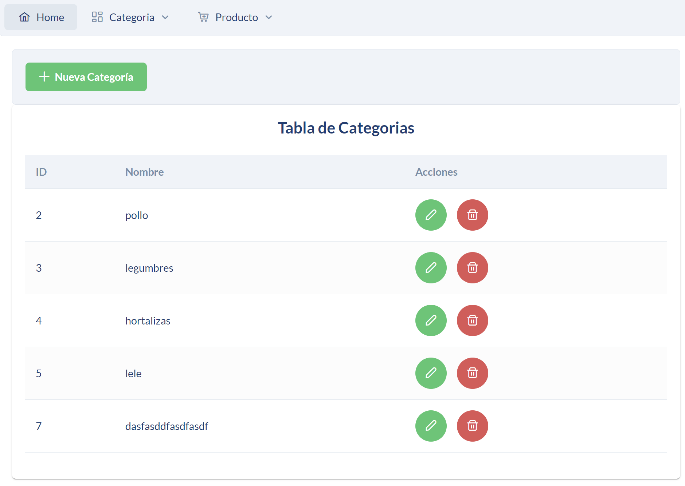
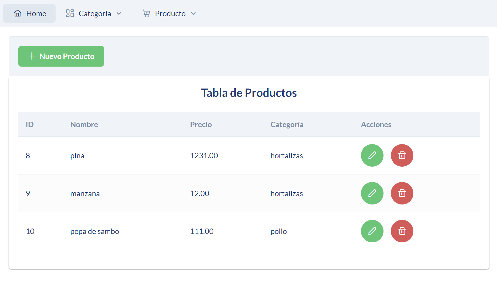

# Gestión de Productos y Categorías

Este proyecto es una aplicación web desarrollada en React que permite gestionar productos y categorías. Los usuarios pueden agregar, editar y eliminar productos y categorías, así como navegar entre diferentes secciones utilizando un menú de navegación.

## Menú
- [Integrantes](#Integrantes)
- [Características](#características)
- [Tecnologías Utilizadas](#tecnologías-utilizadas)
- [Estructura del Proyecto](#estructura-del-proyecto)
- [Requisitos Previos](#requisitos-previos)
- [Instalación](#instalación)

## Integrantes

- **Jhon Bedoya**
- **Milena Reyes**
- **Alanis Tenemaza**
- **Santiago Llumiquinga**

## Características

- **Gestión de Productos**: Agregar, editar y eliminar productos, cada uno asociado a una categoría.
- **Gestión de Categorías**: Agregar, editar y eliminar categorías.
- **Navegación Intuitiva**: Los usuarios pueden navegar fácilmente entre las secciones mediante un menú o navbar.
- **Validaciones de Formulario**: Validaciones integradas en los formularios para asegurar que los datos ingresados sean correctos.
- **Feedback al Usuario**: Notificaciones mediante `Toast` que informan sobre el éxito o el fallo de las operaciones.

## Tecnologías Utilizadas

- **React**: Biblioteca de JavaScript para construir interfaces de usuario.
- **PrimeReact**: Biblioteca de componentes de UI para React, utilizada para los elementos de la interfaz como menús, formularios, tablas y diálogos.
- **Axios**: Cliente HTTP para realizar solicitudes a la API backend.
- **react-router-dom**: Para la gestión de las rutas y la navegación en la aplicación.

## Estructura del Proyecto

- `src/`
  - `components/`
    - `Home.js`: Página de inicio que guía al usuario sobre cómo navegar por la aplicación.
    - `MenuBar.js`: Componente de barra de menús para la navegación.
    - `Categorias.js`: Componente para la gestión de categorías.
    - `Productos.js`: Componente para la gestión de productos.
  - `App.js`: Componente principal que define las rutas de la aplicación.
  - `index.js`: Punto de entrada de la aplicación.

## Requisitos Previos

Asegúrate de tener instalados los siguientes programas:

- Node.js (>= 12.x)
- npm (>= 6.x)

## Instalación

1. Clona el repositorio en tu máquina local.

   ```bash
   git clone https://github.com/Wilz22/mi-tienda

2. Ahora importaras la base de datos que se encuentra en el archivo: mitiendadb.sql para que te funcione correctamente el backend.

3. Tendremos 2 carpetas una del frontend y otra del backend, para que funcione correctamente debemos inicializar el backend para ello
accederemos a la ruta del backend y luego le ejecutaremos el backend.

    ```
    cd backend
    node index.js
    ```

4. Con esto ya tendriamos el backend corriendo ahora nos iremos a la ruta del frontend y ejecutaremos los siguientes pasos para que funcione correctamente el frontend

    ```
    cd frontend
    npm install
    npm start
    ```
5. Y con esto tendremos funcionando la aplicación en donde estará corriendo el backend y el frontend


## Imágenes del dashboard
1. Home


2. Categories



3. Insert Categories


4. Products



5. Insert Products


